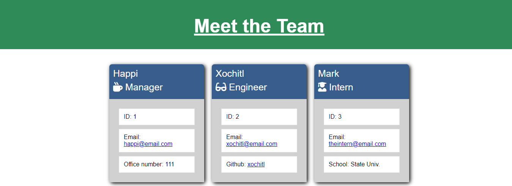

# Team Profile Generator

## Description
###
This generator takes in information about employees on the software engineering team and generates an HTML webpage that displays summaries for each person.

WHEN the application is opened, you are presented with the employee's name, employee ID, email address, and office number if it's the manager or Github username if it's an engineer or intern.  

The email and github links are clickable and will connect you to their respective github page or email client.  

When the application is started, you are prompted to enter team information.  

## App Links
###
<a href=https://drive.google.com/file/d/1Jiz1aWEWasXcemWGdTyCWB6GUHBUN17A/view> Walkthrough Video

<a href=https://github.com/mrgssg/team-profile-gen10> Github 

<a href=https://mrgssg.github.io/team-profile-gen10> Deployed URL

## Sample image generated from HTML: 

